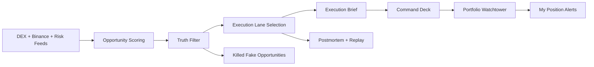

# Goldlane

<p align="center">
  
</p>

<p align="center">
  <strong>A Binance-first real opportunity terminal for live profit windows.</strong>
</p>

<p align="center">
  Goldlane does not just show where the market is moving. It ranks which windows are actually tradable,
  which ones are fake, and how they should be executed.
</p>

<p align="center">
  
  
  
  
</p>

## What Goldlane Is

Goldlane is a realtime trading decision terminal built around one core idea:

**Find real profit windows. Kill fake ones.**

It combines:

- Binance spot and futures execution lanes
- DEX price discovery and liquidity checks
- token risk filters
- opportunity scoring
- execution briefs
- postmortems
- personal watchtower and alert policies

The product is deliberately not a generic market dashboard. It is designed to answer:

1. Is this a real opportunity?
2. Is it actually executable?
3. Which lane should I use: `spot`, `futures`, `basis`, or `watch`?
4. If not, why is it fake?

## Why It Feels Different

Most crypto dashboards optimize for more data. Goldlane optimizes for better decisions.

- It does not rank by noise alone. It ranks by **net executable edge**.
- It does not treat every spread as alpha. It explicitly kills **broken markets** and **fake edges**.
- It does not stop at discovery. It returns a structured **Execution Brief**.
- It does not collapse when upstream live feeds wobble. It falls back to **stale snapshots** instead of dying with a blank error state.

## Product Surface

The current UI is organized as a full working terminal:

- `Top Opportunities Now`
- `Command Deck`
- `Alert Center`
- `Regime Ops`
- `Killed Fake Opportunities`
- `What Changed`
- `Watch & Recheck`
- `Opportunity Check`
- `Execution Brief`
- `Postmortem`
- `Journal Mode`
- `Portfolio Mode`
- `Portfolio Watchtower`
- `My Position Alerts`
- `Alert Policy Center`

## Screenshot

<p align="center">
  
</p>

## Core Loop



## Realtime Modes

Goldlane has explicit runtime states instead of pretending every response is equally fresh.

| Mode | Meaning | What the UI should tell the user |
| --- | --- | --- |
| `live` | All hot-path sources are healthy enough for full live opportunity scoring | This is the real realtime view |
| `degraded` | Some sources are stale or partially unavailable, but live scoring still works | Be more selective, source health matters |
| `stale-fallback` | Core live feeds are unavailable; Goldlane serves the last valid overview or a history-backed emergency snapshot | Good for monitoring and review, not for high-confidence fresh entry |
| `demo-fallback` | Static front-end fallback | Only for local demo continuity |

## Data Sources

Hot path:

- Binance Spot public market data
- Binance USD-M futures mark / funding context
- DexScreener token pairs and liquidity

Medium-speed review layer:

- GoPlus token security
- CoinGecko market context
- Fear & Greed regime context

Optional:

- CryptoCompare news status

## Local Run

```bash
npm start
```

Open:

```bash
http://localhost:4173
```

Optional environment variables:

```bash
HOST=127.0.0.1
PORT=4173
RIFT_HTTP_TRANSPORT=fetch
```

## API Surface

Main endpoints:

- `GET /api/live/overview`
- `GET /api/live/stream`
- `GET /api/live/token/:symbol`
- `GET /api/health`
- `POST /api/warrant/check`

Detailed contracts live in [`API-CONTRACTS.md`](./API-CONTRACTS.md).

## Repo Structure

```text
.
├── assets/
│   └── goldlane-readme-cover.svg
├── data/
│   └── opportunity-history.json
├── index.html
├── styles.css
├── app.js
├── server.js
├── API-CONTRACTS.md
├── README.md
└── ui-validation.png
```

## Validation

Verified locally on `2026-03-18`:

- `node --check app.js`
- `node --check server.js`
- `/api/live/overview` returns `stale-fallback` instead of `500` when core feeds are down
- `/api/live/stream` continues pushing `overview` events in stale mode
- the full page renders with the Binance-first UI and cover-aligned styling

## Current Boundaries

- This is a `live beta`, not an official Binance Skills API integration
- Estimated PnL and opportunity scores are internal product estimates, not guaranteed returns
- Journal, portfolio, and alert policy layers are still browser-local
- The product is resilient to feed failures, but **full live mode still depends on upstream network reachability**

## Roadmap

- Restore stable full-live coverage for Binance + DexScreener on the current machine
- Add Telegram / webhook delivery for personal alerts
- Persist personal mandate and portfolio state server-side
- Add richer replay charts and historical case memory

## Design Direction

Goldlane intentionally avoids looking like a generic crypto dashboard.

- Binance-first visual identity
- dark glass surfaces with gold accents
- explicit state language
- terminal-like decision density
- strong distinction between real opportunities and fake ones

## License

No license has been added yet. If you want to open-source it formally, add a license before inviting outside contributions.
