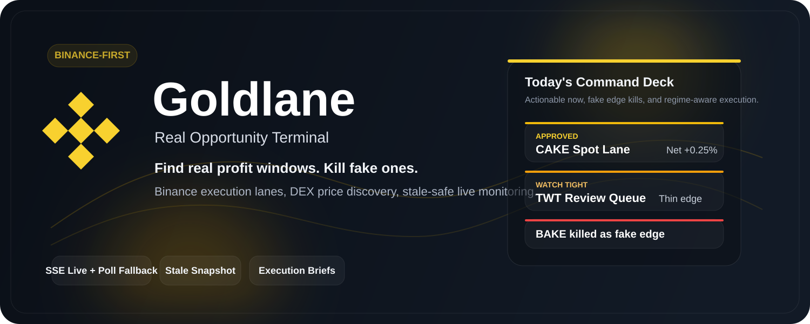
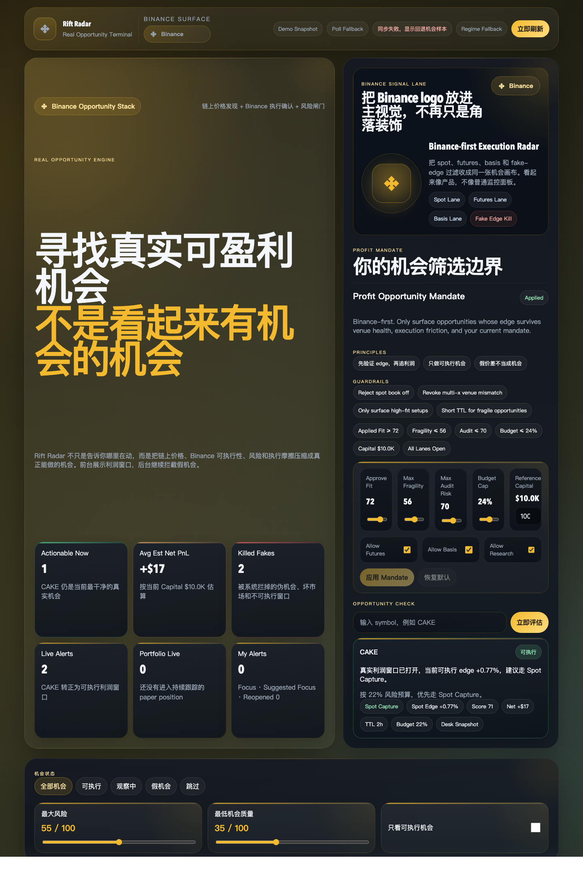

# Goldlane

<p align="center">
  
</p>

<p align="center">
  <strong>真实可盈利机会终端</strong>
</p>

<p align="center">
  先筛掉假机会，再把真正可执行、利润还活着的窗口推到你面前。
</p>

<p align="center">
  
</p>

## 这是什么

Goldlane 是一个面向 Binance 场景的实时机会终端。

它不做“全市场热闹榜”，只回答 4 个用户真正关心的问题：

1. 现在有没有值得做的机会。
2. 这个机会是真机会，还是坏市场假象。
3. 该走 `spot`、`futures`、`basis`，还是先别做。
4. 如果已经在盯这个机会，什么时候该复审、该撤。

一句话：

**Goldlane 不是告诉你哪里在涨，而是告诉你哪里真的能做、还能赚、现在值不值得做。**

## 适合谁

- 需要同时看 Binance 和链上价格的人
- 不想被“看起来很大”的假价差骗的人
- 想把盯盘流程收成一套固定工作台的人
- 想持续记录自己 thesis、机会和复审节奏的人

## 打开页面先看哪里

### 1. `Opportunity Spotlight`

首屏最上方只放当前最值得先看的机会。

你会直接看到：

- 当前状态
- 预计净收益
- 建议执行通道
- 复审时点

如果这张卡都不成立，就不需要先翻下面的大盘列表。

### 2. `Top Opportunities Now`

这里只放已经通过利润、执行和风控过滤的机会。

每张卡只保留 4 个对交易最有用的字段：

- 能不能做
- 预估净收益
- 走哪条 lane
- 多久后复审

### 3. `Alert Center`

这里只保留高价值变化，不刷噪音。

默认只关心：

- 机会转正
- 机会失效
- 净收益转负
- 临近复审

### 4. `Do Not Touch`

这是反向筛选区。

它专门告诉你哪些窗口“看起来很香，但别碰”，例如：

- 坏市场
- 失活盘口
- venue mismatch
- 成本吃掉利润

### 5. `My Watchtower` / `Portfolio Mode`

这两块只服务你的个人盯盘。

- `My Watchtower`：你已经记成“准备做”的机会，现在有没有 thesis 变坏
- `Portfolio Mode`：你的 paper position 现在浮动如何、机会还活着没有

## 推荐使用方式

### 盘前

只看两块：

- `Opportunity Spotlight`
- `Top Opportunities Now`

目标不是看更多，而是先锁定今天值得处理的 1 到 3 个机会。

### 盘中

优先看：

- `Alert Center`
- `My Watchtower`

目标是处理变化，而不是不停刷新所有数据。

### 下单前

直接用 `Quick Check` 输入 symbol。

它会给你一个简化结论：

- 现在能不能做
- 应该走什么 lane
- 预计还能剩多少净边际
- 多久后要重新看

### 盘后

看：

- `Do Not Touch`
- `Portfolio Mode`

目标是复盘自己今天避开了什么坑、哪些 thesis 还需要继续盯。

## 页面模块说明

| 模块 | 作用 | 用户为什么需要它 |
| --- | --- | --- |
| `Opportunity Spotlight` | 首屏唯一重点机会 | 打开就知道先看什么 |
| `Top Opportunities Now` | 当前最值得做的机会列表 | 不用自己从全量市场里筛 |
| `Alert Center` | 只推高价值变化 | 降低噪音，提高反应速度 |
| `Opportunity Radar` | 看机会在升温还是降级 | 知道现在是进还是等 |
| `Do Not Touch` | 展示高风险伪机会 | 少踩坑 |
| `My Watchtower` | 只看你自己的 thesis 风险 | 提醒你先处理自己的问题 |
| `Portfolio Mode` | 跟踪 paper position | 看机会是否还成立 |
| `Market Board` | 全量机会队列 | 只有在要扩展搜索范围时才看 |
| `Inspector` | 当前选中机会的决策面板 | 给出下一步动作，而不是一堆原始指标 |

## 实时模式说明

Goldlane 不会假装所有数据都一样新。

| 模式 | 含义 | 你该怎么理解 |
| --- | --- | --- |
| `live` | 核心实时源正常 | 可以作为真实盘中参考 |
| `degraded` | 部分实时源变慢或缺失 | 可以继续盯，但要更保守 |
| `stale-fallback` | 上游核心源不可用，系统退回最近有效快照 | 适合监控和复审，不适合高信心新开仓 |
| `demo-fallback` | 纯前端演示回退 | 只用于本地展示连续性 |

## 界面预览

<p align="center">
  
</p>

## 本地启动

```bash
npm start
```

默认打开：

```bash
http://localhost:4173
```

可选环境变量：

```bash
HOST=127.0.0.1
PORT=4173
RIFT_HTTP_TRANSPORT=fetch
```

## 配置 Binance API

Goldlane 现在支持直接在 Web 界面里填写 Binance API，并由后端保存到 `.env`。

推荐做法：

1. 使用只读 API Key / Secret。
2. 打开首屏右侧的 `连接你的 Binance 实时通道`。
3. 填入 `API Key`、`API Secret`。
4. 先点 `测试连接`，再点 `保存到 .env`。
5. 保存后 Goldlane 会立即重新拉起实时链路。

你也可以手动创建 `.env`：

```bash
cp .env.example .env
```

支持的环境变量：

```bash
BINANCE_API_KEY=
BINANCE_API_SECRET=
BINANCE_SPOT_API_BASE=https://api.binance.com
BINANCE_FUTURES_API_BASE=https://fapi.binance.com
BINANCE_SPOT_FALLBACK_BASES=https://api1.binance.com,https://api2.binance.com,https://api3.binance.com,https://data-api.binance.vision
BINANCE_FUTURES_FALLBACK_BASES=https://fapi1.binance.com,https://fapi2.binance.com,https://fapi3.binance.com
```

说明：

- `.env` 已加入 `.gitignore`
- 前端不会直接读取你的 Secret
- Goldlane 会把凭证留在服务端，用来校验连接并增强 Binance 实时链路

## 主要接口

- `GET /api/live/overview`
- `GET /api/live/stream`
- `GET /api/live/token/:symbol`
- `GET /api/health`
- `POST /api/warrant/check`

详细字段合同见：[API-CONTRACTS.md](./API-CONTRACTS.md)

## 数据来源

快路径：

- Binance Spot 公共行情
- Binance USD-M futures 上下文
- DexScreener 价格与流动性

中速校验层：

- GoPlus 风险信息
- CoinGecko 市场上下文
- Fear & Greed 市场环境

## 当前边界

- 这是 `live beta`，不是官方 Binance Skills 直连产品
- 预估净收益、机会分数、执行建议都属于内部估算，不是收益承诺
- Journal、Portfolio、Alert Policy 目前仍是浏览器本地状态
- 是否进入 `full live` 仍然依赖本机到 Binance / DEX 上游的网络可达性
- Binance API 会显著改善 Goldlane 的接入方式和验证能力，但不能替代本机网络连通性本身

## 已完成验证

本地已验证：

- `node --check app.js`
- `node --check server.js`
- `/api/live/overview` 在上游不可用时会回到 `stale-fallback`，而不是直接 `500`
- `/api/live/stream` 在 stale 模式下仍会持续推送 `overview`
- 页面已接入 Binance logo 资源并采用 Binance-first 视觉
- `/api/settings/binance` 已支持读取、测试并把 Binance API 持久化到 `.env`

## 仓库结构

```text
.
├── assets/
│   ├── binance-logo-card.svg
│   └── goldlane-readme-cover.svg
├── data/
│   ├── last-live-overview.json
│   └── opportunity-history.json
├── index.html
├── styles.css
├── app.js
├── server.js
├── API-CONTRACTS.md
├── README.md
└── ui-validation.png
```

## 接下来最值得做的

- 恢复当前机器的稳定 full-live 上游可达性
- 把个人提醒接到 Telegram / Webhook
- 把 Portfolio 和 Mandate 做成服务端持久化
- 增加更清晰的 replay 时间轴和 case memory
